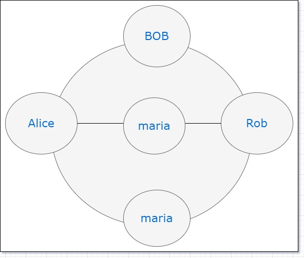

###  **Graph** ###

1. [Program1.java](#Program1)
2. [Program2.java](#Program2)
3. [Program3.java](#program3)
4. [Program4.java](#program4)
5. [Program5.java](#program5)
6. [Program6.java](#program6)
7. [Program7.java](#program7)

#### Program1
    
 using Map 1. addVertex 2.addEdge 3.removeVertex
    
#### Program2
    create a graph using Matrix 1. addVertex 2. addEdge 3. removeVertex
#### Program3
   breadth first traversal
#### Program4
    Depth first traversal
#### Program5
    toplogical sorting using DFS
#### Program6
    number of courses completed in semester
#### Program7
